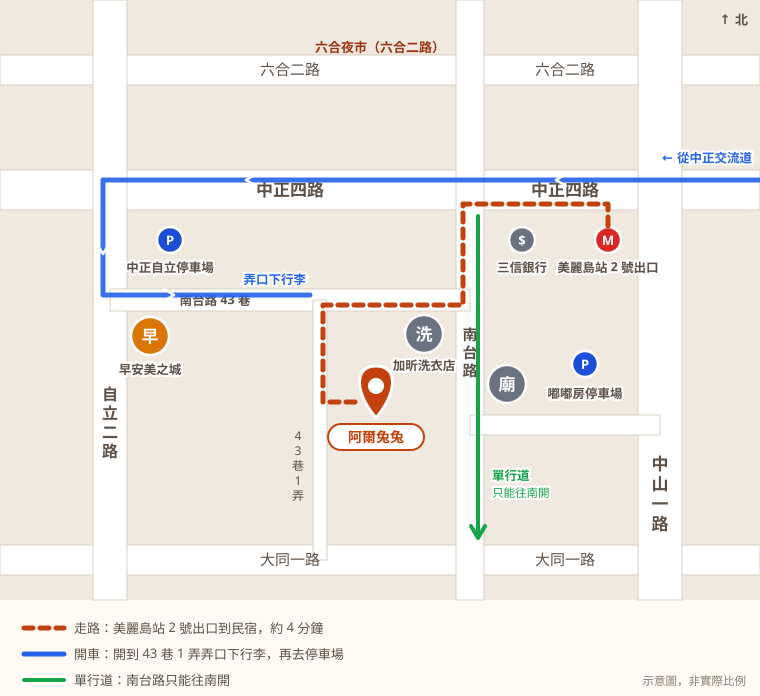
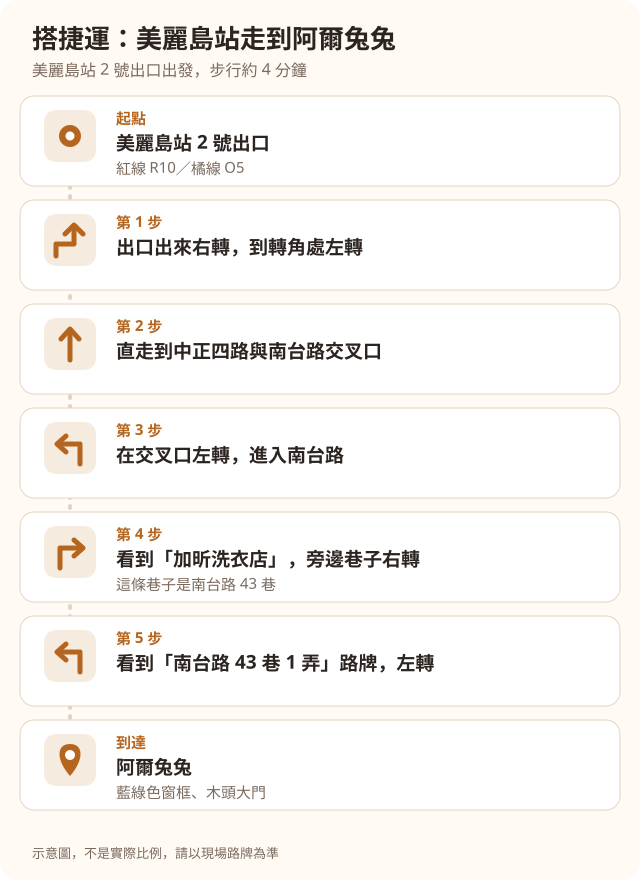
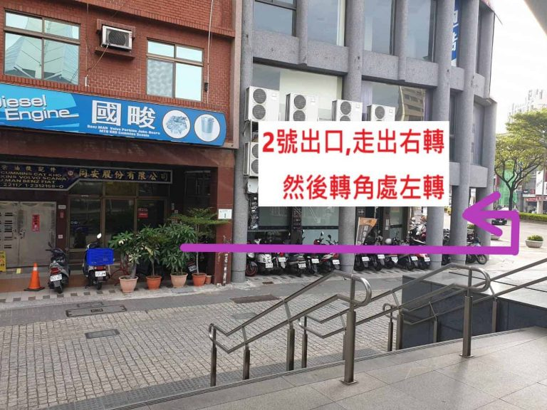
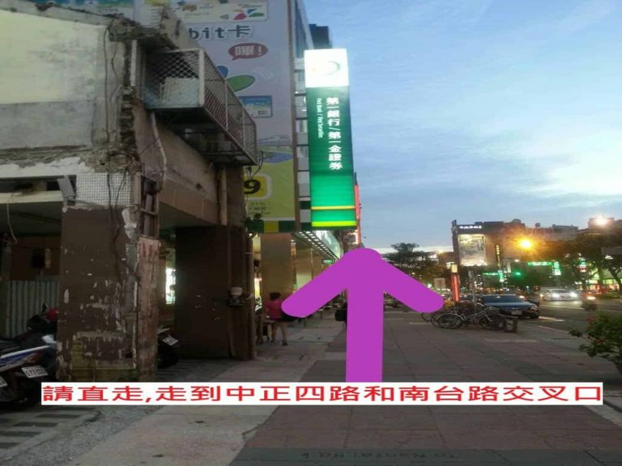
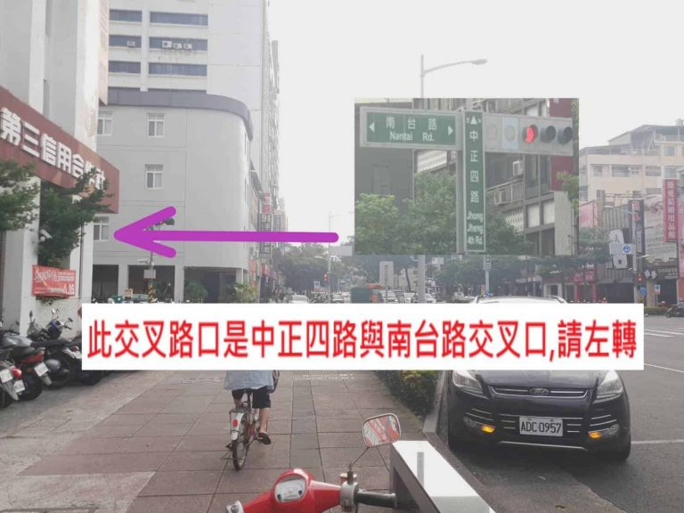
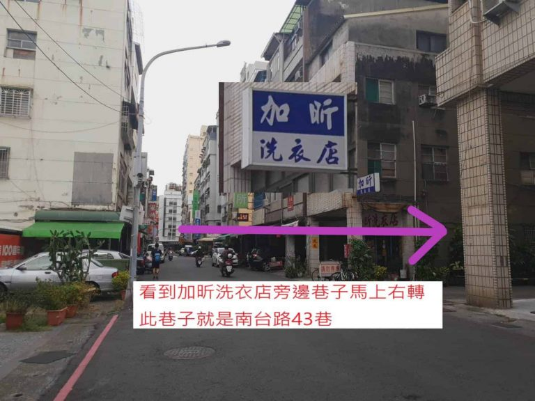
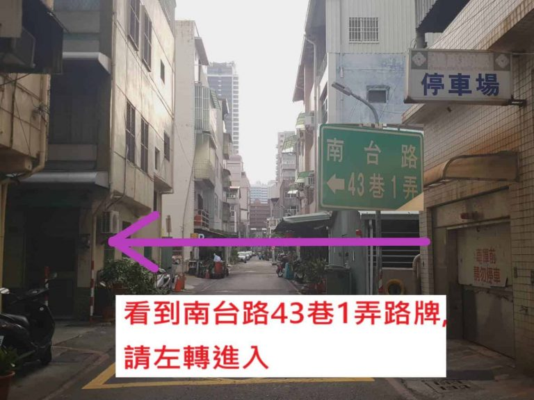
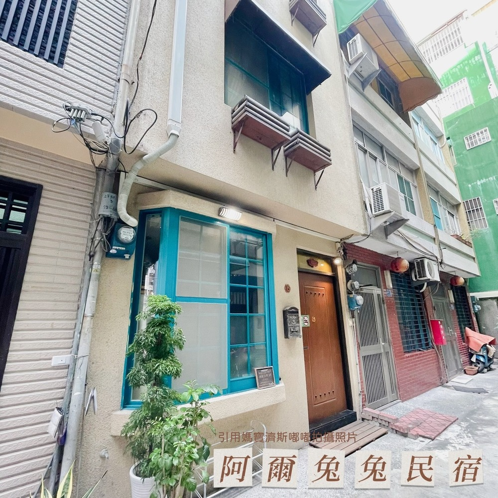
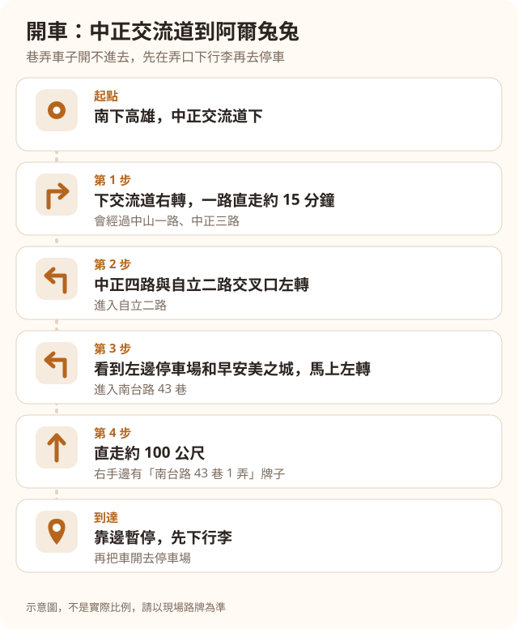

想找 **美麗島住宿**，最在意的通常是：從捷運站走過去要多久、路好不好找。

阿爾兔兔民宿在美麗島站 2 號出口，步行大約 4 分鐘。走到六合夜市也是 4 分鐘左右。

這篇用區域地圖、步驟圖和實景照片，帶你一步一步從捷運站走到民宿。開車的路線和停車方式也一起整理在下面。

## 住美麗島站附近的好處

### 紅線、橘線都會經過

美麗島站是高雄捷運紅線（R10）和橘線（O5）交會的轉乘站，要換另一條線，在這一站就能換。

### 六合夜市就在旁邊

晚上想吃宵夜，走幾分鐘就到六合夜市，不用開車找停車位。

### 中央公園也在附近

離中央公園也很近，早上想散步，或帶毛小孩出去走走都很方便。

### 離高雄火車站很近

從高雄火車站開車過來大約 3 分鐘。

## 交通：美麗島站 2 號出口步行 4 分鐘

先看這張區域地圖，了解民宿、捷運站和停車場的位置。

*區域地圖（示意圖，非實際比例）*

### 搭捷運走過來

這張步驟圖可以截圖存在手機裡，邊走邊看。

下面是每一步的實景照片。

**第 1 步：從 2 號出口出來右轉，走到轉角處左轉。**

**第 2 步：直走到中正四路與南台路的交叉口。**

**第 3 步：在中正四路與南台路交叉口左轉，進入南台路。**

**第 4 步：看到「加昕洗衣店」，旁邊的巷子馬上右轉，這條巷子就是南台路 43 巷。**

**第 5 步：看到「南台路 43 巷 1 弄」的路牌，左轉進去。**

**到達：藍綠色窗框、木頭大門，就是阿爾兔兔。**

### 開車過來

南下高雄的話，從中正交流道下來最方便。

1. 中正交流道下來右轉，沿著中正路一路直走約 15 分鐘，會經過中山一路、中正三路。
2. 在中正四路與自立二路交叉口左轉，進入自立二路。
3. 看到左邊的停車場和早安美之城早餐店，馬上左轉，進入南台路 43 巷。
4. 直走約 100 公尺，右手邊會看到「南台路 43 巷 1 弄」的牌子。
5. 在弄口靠邊暫停，先下行李，再把車開去停車場。

43 巷 1 弄車子開不進去，所以要先在弄口下行李。

另外，南台路從中正四路到大同一路是單行道，只能往南開，開車時請留意。

**附近的停車場**

民宿沒有特約停車場，停車要自行繳費。附近有兩個停車場：

- 中正自立停車場：中正四路 61 號
- 嘟嘟房停車場：中山一路 69-1 號

收費方式請見[停車資訊](https://ar2two.com/ar2two-parking/)。

## 晚上逛六合夜市，走回來很近

從阿爾兔兔走到六合夜市大約 4 分鐘。吃完宵夜散步回來，不用煩惱停車和叫車。

晚上走回民宿的路上都有路燈，巷子裡也滿安靜的，逛完夜市可以好好休息。

## 阿爾兔兔是什麼樣的住宿

- 6 間房，基本床位 19 人，可以單訂房間，也可以[包下整棟](https://blog.ar2two.com/blog/gaoxiong-whole-house-homestay-10-people/)。
- 全房型都可以帶寵物，狗狗只接受中小型犬。詳細請見[寵物友善文章](https://blog.ar2two.com/blog/gaoxiong-pet-friendly-homestay-guide/)。
- 免費早餐是高雄在地老店「老江紅茶牛奶」。
- 下午 3 點後入住，沒有最晚入住時間，採自助入住。
- 民宿沒有電梯。

每間房的照片請見[6 個房型介紹](https://ar2two.com/ar2two-room-introduction/)。

## 常見問題

### 美麗島站走到阿爾兔兔要幾分鐘？從哪個出口出來？

從美麗島站 2 號出口出來，步行大約 4 分鐘。

### 開車可以停哪裡？

民宿沒有特約停車場。可以停附近的中正自立停車場或嘟嘟房停車場，都要自行繳費。巷子車子開不進去，請先在南台路 43 巷 1 弄弄口下行李。

### 很晚才到高雄，還可以入住嗎？

可以。阿爾兔兔沒有最晚入住時間，深夜到達時核對證件後就能自助入住。

### 可以帶狗住嗎？

可以，全房型都能帶寵物，狗狗只接受中小型犬。

---

想住在美麗島站旁邊、走路就能逛六合夜市，歡迎看看阿爾兔兔的空房。

[查看空房與訂房資訊](https://ar2two.com)
