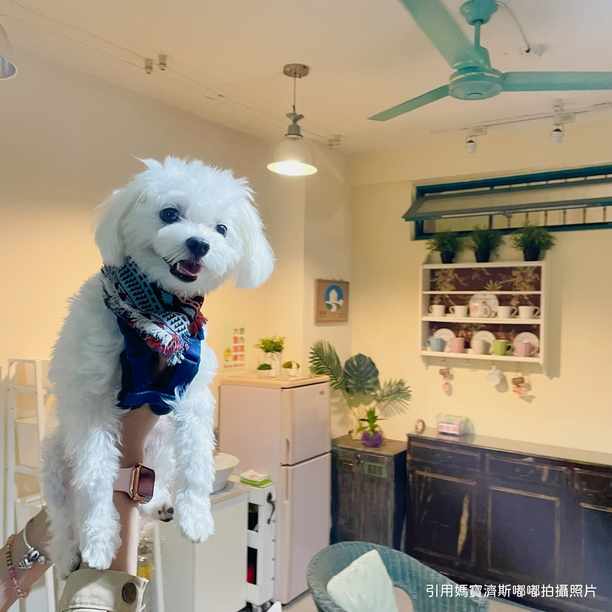
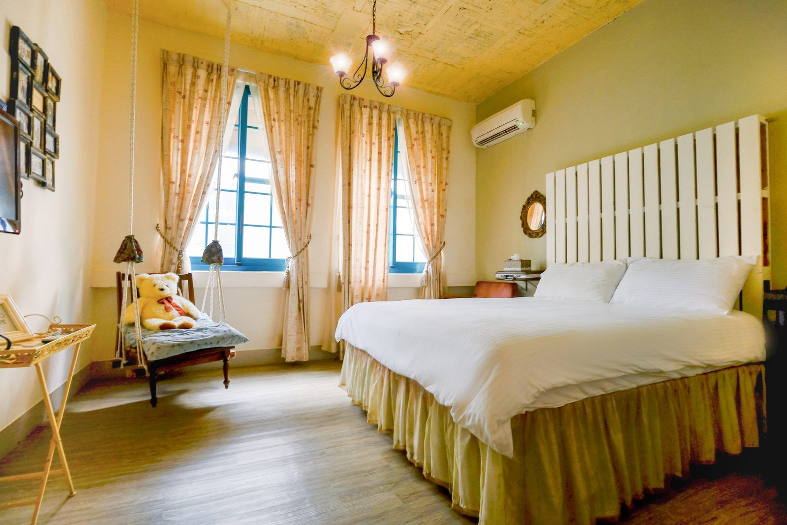
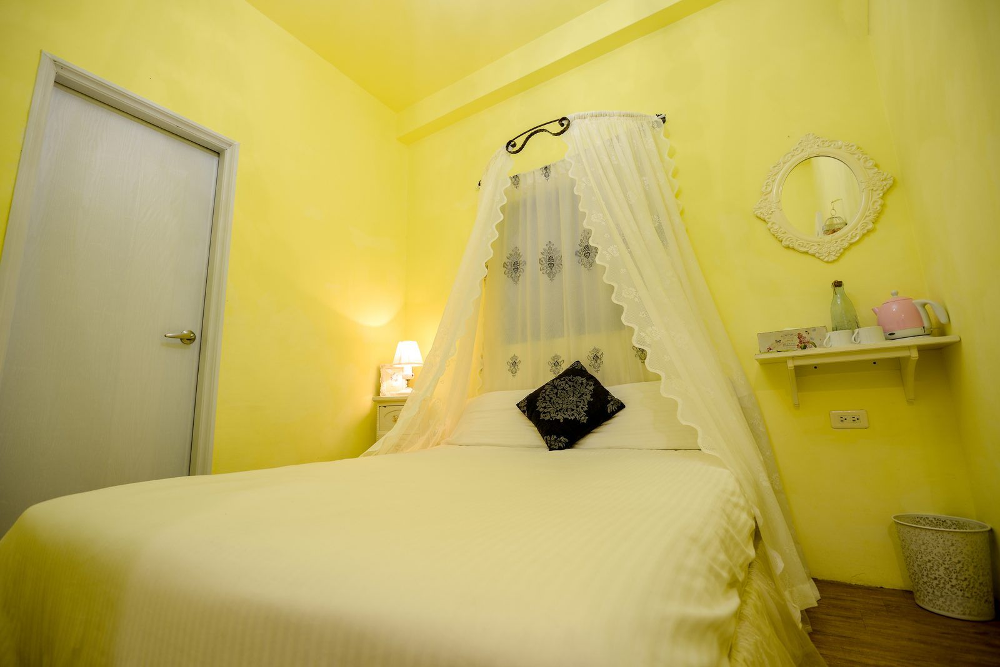
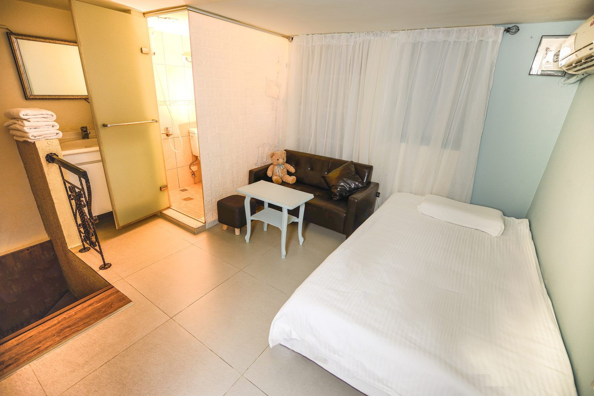
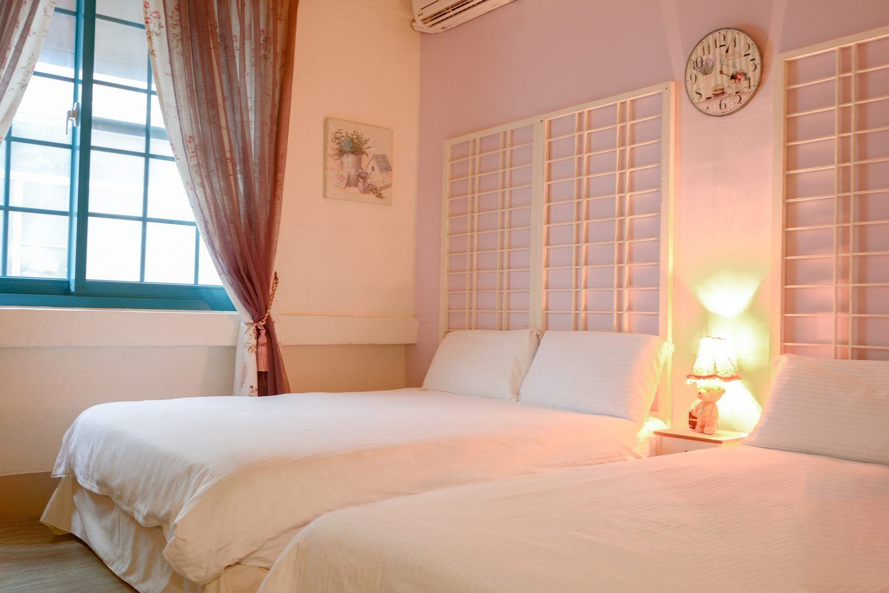
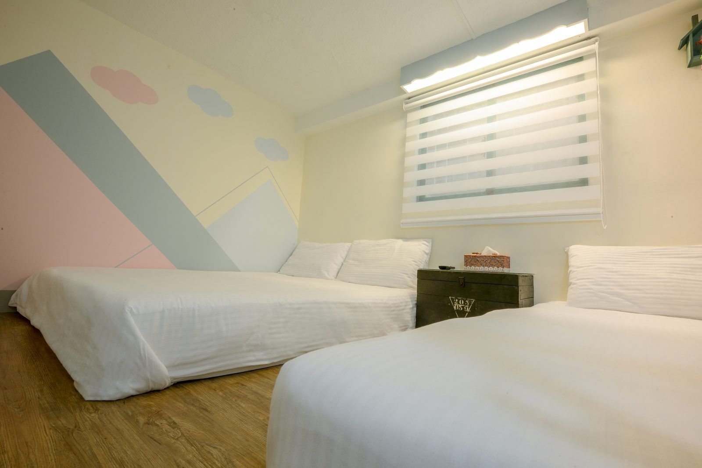
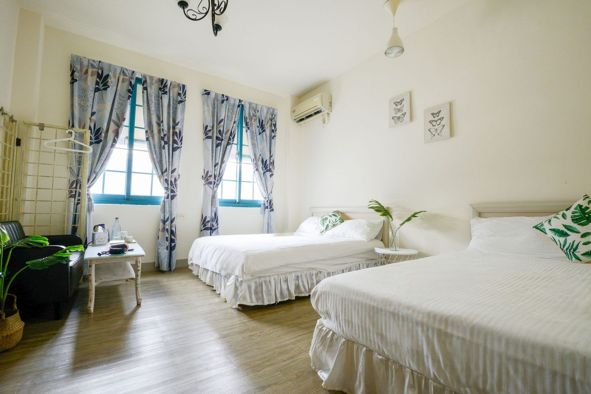

帶著貓狗一起旅行，最怕的就是到了現場才發現「其實沒那麼寵物友善」。想找 **高雄寵物住宿推薦** 名單之前，這篇先整理挑民宿時值得優先確認的 6 個重點，幫你在訂房前就先過濾掉會踩雷的選項。

## 1. 是否可以包棟、或有更彈性的訂房方式

如果同行人數多、或不希望跟其他房客共用空間，「包棟」是最安心的選擇；但如果只是兩三人小旅行，能不能單訂房間也很重要——彈性越高，越能配合不同旅遊人數。

## 2. 清潔與消毒是否有明確 SOP

好的寵物友善民宿，退房後一定會有針對寵物毛髮、氣味的清潔流程，而不是「跟一般房間用同一套打掃方式」。可以進一步詢問是每次退房都清潔消毒，還是只有定期才做一次大清潔。

## 3. 周邊是否有適合散步、放電的環境

長途移動後，毛孩也需要活動。訂房前可以先確認民宿鄰近是否有公園、河堤或寬闊的人行空間，方便早晚遛毛孩。

## 4. 室內活動空間是否足夠

如果民宿本身空間較小、家具較多，毛孩容易受限或碰撞受傷。建議選擇室內動線寬敞、家具邊角有防護的空間。

## 5. 是否有明確的寵物入住規範

包含隻數上限、清潔費用、是否可以獨留寵物在房內等規定，出發前先確認清楚，才不會到現場才發生認知落差。

## 6. 是否有提供寵物相關的設備

有些民宿會準備飼料碗、便盆、圍欄、防滑墊等基本用品，能省下不少行李空間；出發前可以先問清楚有哪些是現場提供的，哪些還是要自己帶。

---

如果你正在計畫高雄的寵物友善小旅行，歡迎認識 **阿爾兔兔民宿**：

*阿爾兔兔民宿整棟外觀*

- 空間彈性：可包整棟，也可以單訂房間
- 寵物用品：提供免洗杯、免洗碗給攜帶寵物入住的房客使用
- 清潔消毒：每日退房都有寵物毛髮、氣味清潔，另有每月一次的重大消毒機制
- 周邊環境：離高雄中央公園非常近，方便早晚遛毛孩；步行 4 分鐘可達高雄六合夜市、高雄捷運美麗島站
- 費用：官網直訂單隻寵物不加收清潔費（多隻另計），詳細收費與注意事項請見[寵物入住規範](https://ar2two.com/pet-rule/)

*毛小孩可以一起待在公共空間*

### 房型參考

*旅程 吊椅2人房*

*幔幔 公主2人房*

*闔家 親子樓中樓3人房*

*悠然 蛋椅鄉村4人房*

*趣味 親子樓中樓4人房*

*雀屏 文青4人房*

## 常見問題

### 帶寵物入住要加錢嗎？

直接透過阿爾兔兔官網、LINE、FB 或電話訂房，一隻寵物不收清潔費。同一間房 2 隻收 300 元、3 隻 500 元、4 隻 1,000 元，整趟住宿只收一次。

### 從訂房平台訂，寵物也免費嗎？

不是。從任何第三方訂房平台訂房，每隻寵物每晚收 500 元。

### 大型犬可以入住嗎？

不行，阿爾兔兔只接受中小型犬。

### 可以把寵物留在房間，自己出去吃飯嗎？

不行，寵物不能單獨留在房內。違反的話每隻收 1,000 元。

### 寵物可以上床、上沙發嗎？

不行。床單有寵物毛髮或髒污的話，收床單清潔費每床 600 元。

[查看空房與訂房資訊](https://ar2two.com)
