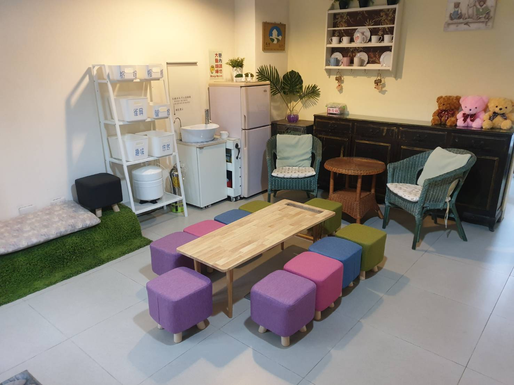
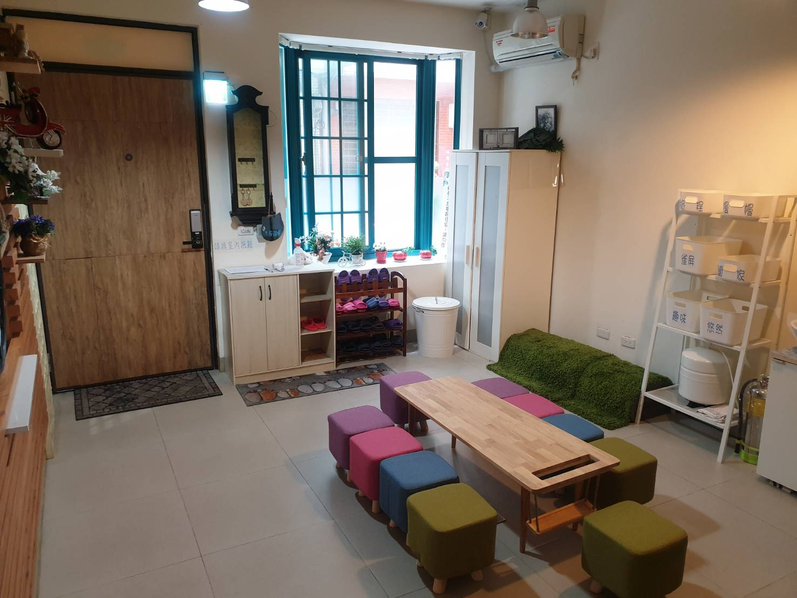

大約 10 個人想在 **高雄包棟民宿** 住一晚，訂房前先確認 4 件事：床位夠不夠、有沒有大家能聚在一起的公共空間、交通方不方便、安靜時間和取消規定。

這篇先整理這 4 件事怎麼看，再介紹我們阿爾兔兔民宿的包棟方案和價格，方便你直接比較。

## 10 人包棟，訂房前先確認的 4 件事

### 1. 床位夠不夠、要不要加床

先算清楚實際要睡幾個人，再看民宿的「基本床位」。

基本床位比人數多一點比較舒服，臨時多 1、2 個朋友也不用擔心。

如果剛好差幾床，問清楚能不能加床、加床怎麼收費。

### 2. 有沒有能一起吃東西、聊天的公共空間

包棟的樂趣是大家能聚在一起。

只有房間、沒有公共空間的話，10 個人只能分散在各房間，買回來的宵夜也沒地方一起吃。

訂房前可以問民宿：公共空間有多大、桌椅夠不夠 10 個人坐。

### 3. 交通與停車

10 個人分好幾台車或搭捷運到，集合地點方不方便很重要。

離捷運站和夜市近，晚上出去吃東西、隔天去景點都比較好安排。

開車的話，先問清楚附近哪裡可以停車。

### 4. 安靜時間與取消規定

人多容易聊到很晚，先知道民宿幾點後要降低音量，才不會影響鄰居。

包棟的取消規定通常比單訂房間嚴格，出發前先確認，行程有變動時才不會損失太多。

## 阿爾兔兔的包棟方案與價格

阿爾兔兔在高雄市新興區，整棟 6 間房，基本床位 19 人。

全棟最多可以加 3 床，最多住到 22 人。加床每床酌收 500 元。

不管選哪一種包棟方案，整棟都只住你們這一團。沒包到的房間，也不會再租給其他客人。

| 方案 | 價格 | 備註 |
|---|---|---|
| 平日每人計價 | 每人 700 元，最少 10 人，合計 9,000 元 | 任選 3 間房，含公共空間；只限 3 月和 11 月 |
| 平日 4 間房 | 合計 10,800 元 | 房間任選；只限 3 月和 11 月 |
| 平日 6 間房 | 合計 13,000 元 | |
| 星期五 6 間房 | 合計 14,000 元 | |
| 星期六 6 間房 | 合計 17,000 元 | |

- 押金 2,500 元，退房檢查沒問題就歸還。
- 透過阿爾兔兔官網或 LINE 直接訂，不收包棟清潔費。
- 透過其他訂房平台訂 6 間房，另收包棟清潔費 3,000 元。

完整方案與最新價格，請見官網的[包棟方案與價格](https://ar2two.com/building-price/)。

### 大廳固定擺著長桌，10 個人可以坐在一起

大廳固定擺著 1 張長桌和 10 張馬卡龍椅。

晚上從六合夜市買宵夜回來，大家可以圍著長桌一起吃、一起聊。

*大廳的長桌與馬卡龍椅*

*一進大門就是公共空間*

### 每個人都有免費早餐

包棟時，每位入住的旅客都有免費早餐，加床的旅客也一樣。

基本床位 19 人就準備 19 份，加 3 床就準備 22 份。

早餐是高雄在地老店「老江紅茶牛奶」。入住當天晚上 10 點前要預訂，詳細請見[免費早餐](https://ar2two.com/ar2twobreakfast/)。

## 6 個房型一覽

6 間房各有不同風格，包棟時可以依照每個人的需求分房。

阿爾兔兔沒有電梯。家裡有長輩或行動不便的旅伴，可以安排住在 1 樓的闔家親子樓中樓 3 人房。

*旅程 吊椅2人房：房間有趣味吊吊椅和 2 個大對外窗*

*幔幔 公主2人房：小鵝黃水晶燈和布簾式床頭*

*闔家 親子樓中樓3人房：在 1 樓，有兒童遊戲區*

*悠然 蛋椅鄉村4人房：鄉村風搭配蛋椅*

*趣味 親子樓中樓4人房：有扮家家酒廚房和玩具的兒童遊戲區*

*雀屏 文青4人房：可以免費玩經典任天堂紅白機*

每間房的照片和床型，請見官網的[6 個房型介紹](https://ar2two.com/ar2two-room-introduction/)。

## 帶毛小孩一起包棟

阿爾兔兔全房型都可以帶寵物，包棟時毛小孩也能一起來。

狗狗只接受中小型犬入住。

透過官網或官方 LINE 直接訂包棟，每間房一隻寵物免費，6 間房最多 6 隻毛小孩免費入住。

同一間房帶 2 隻以上，費用請見下方的寵物入住規範。

透過其他訂房平台訂房，寵物入住費每隻每天 500 元。

寵物不能在房間和公共空間大小便，也不能獨留在房間裡。完整規定請見[寵物入住規範](https://ar2two.com/pet-rule/)。

## 交通位置：步行 4 分鐘到美麗島捷運站、六合夜市

從美麗島捷運站 2 號出口走到民宿，大約 4 分鐘。

走到六合夜市也是 4 分鐘左右，晚上出去吃宵夜很方便。

開車來的話，民宿沒有特約停車場，民宿所在的巷子車子也開不進來。建議先停在南台路 43 巷 1 弄弄口下行李，再到附近停車場停車。停車場位置請見[停車資訊](https://ar2two.com/ar2two-parking/)。

## 包棟規定與取消

- 晚上 10 點後請關上大廳窗戶，也請不要在巷子裡大聲喧嘩，避免吵到鄰居。
- 退房前請把大廳的垃圾整理好，放在垃圾桶旁，並關掉冷氣和電燈。
- 預訂時要付清全額。
- 入住前 10 天以前取消，收 30% 手續費。
- 入住前 4～9 天取消，扣 50%。
- 入住前 3 天內不能取消，也不退款。
- 包棟不接受延期。

## 常見問題

### 10 個人可以包棟嗎？

可以。平日 3 月和 11 月有每人 700 元的方案，最少 10 人，任選 3 間房含公共空間，另外 3 間不會再租給其他客人。其他月份可以選 6 間房的包棟方案。

### 平日和假日包棟差多少錢？

6 間房包棟，平日 13,000 元、星期五 14,000 元、星期六 17,000 元。

### 可以帶狗一起包棟嗎？

可以，全房型都能帶寵物，狗狗只接受中小型犬。直接跟民宿訂包棟，每間房一隻寵物免費。

### 跟訂房平台訂，和直接跟民宿訂差在哪？

透過官網或 LINE 直接訂，不收包棟清潔費，每間房一隻寵物免費。透過其他訂房平台訂 6 間房，要另收包棟清潔費 3,000 元，寵物入住費每隻每天另收 500 元。

### 人數超過 19 人可以加床嗎？

可以。全棟最多加 3 床，最多住 22 人，每床酌收 500 元。

---

想知道你的日期還有沒有空房，可以直接看官網的包棟方案，或用 LINE 問我們。

[查看包棟方案](https://ar2two.com/building-price/)

[查看空房與訂房資訊](https://ar2two.com)
