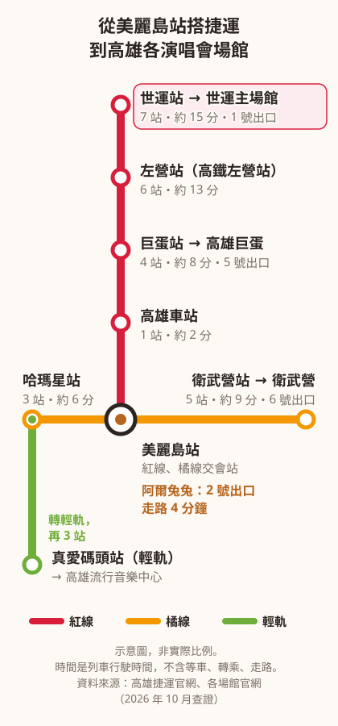

找 **高雄演唱會住宿**，最先要想的是：散場後怎麼回住的地方。

高雄常辦演唱會的場館分散在不同的捷運線上。住在紅線、橘線交會的美麗島站附近，去各場館都能搭捷運。

從美麗島站搭紅線到世運站是 7 站，約 15 分鐘，不用轉車。阿爾兔兔民宿在美麗島站 2 號出口，走路 4 分鐘。

## 高雄常辦演唱會的場館與最近的捷運站

高雄常辦大型演唱會的場館有世運主場館、高雄巨蛋、高雄流行音樂中心和衛武營。從美麗島站出發，這 4 個場館都能搭捷運或輕軌到。

- **世運主場館（高雄國家體育場）**：搭紅線 7 站到世運站，約 15 分鐘。從 1 號出口出站，再走約 800 公尺。
- **高雄巨蛋**：搭紅線 4 站到巨蛋站，約 8 分鐘，從 5 號出口出站。
- **高雄流行音樂中心**：搭橘線 3 站到哈瑪星站，約 6 分鐘，轉輕軌再 3 站到真愛碼頭站。
- **衛武營**：搭橘線 5 站到衛武營站，約 9 分鐘，從 6 號出口出站。

*從美麗島站到各演唱會場館的捷運示意圖*

上面的時間是列車行駛時間，不含等車、轉乘和走路。哪一天有哪一場演唱會，請看各場館官網的活動行事曆。

（資料來源：[高雄捷運站間行駛時間](https://www.krtc.com.tw/Guide/time_between_train)、[高雄捷運營運路線圖](https://www.krtc.com.tw/KLRT/guide_map)、[高雄國家體育場](https://sports.kcg.gov.tw/StadiumDetailC003100.aspx?Cond=7e090023-a03a-4bae-a3c2-4a7e15b8282e)、[高雄巨蛋](https://www.kaoarena.com.tw/Home/Traffic)、[高雄流行音樂中心](https://kpmc.com.tw/transportation/)、[衛武營](https://www.npac-weiwuying.org/traffic-guide)，2026 年 10 月查證）

## 住場館旁邊，還是住市中心？

只看一場、散場想馬上休息，住場館走路就到的地方最省事。

一群朋友一起來、隔天還想在高雄多玩，住市中心的捷運轉乘站比較有彈性。去場館搭捷運，回來還能逛夜市。

當天就要搭高鐵回家的人，也有人選左營高鐵站附近。不過散場後人潮多，要預留排隊進站的時間。

來看演唱會的客人，大多是 2～4 個人一起住。阿爾兔兔的房型有 2 人房、3 人房、4 人房，照片和床型請見 [2～4 人房型介紹](https://ar2two.com/ar2two-room-introduction/)。

## 散場後怎麼回來

大型演唱會散場時，大量人潮會同時離開場館。捷運站要排隊進站，計程車也要排隊。現場人多時，手機網路可能變慢，叫車 app 不一定叫得到。

散場後想馬上趕高鐵回家，時間通常很緊。不想趕，就在高雄住一晚。

阿爾兔兔的客人，回程有人搭捷運，有人搭計程車。搭捷運回到美麗島站，從 2 號出口走 4 分鐘就到民宿，路線照片請見 [美麗島站 2 號出口走回民宿的路線](https://blog.ar2two.com/blog/gaoxiong-meilidao-station-stay/)。

大型演唱會時，高雄捷運常會加開班次。加開的時間和班距每一場都不一樣，請看高雄捷運官網的[新聞稿](https://www.krtc.com.tw/Information/news)和[重要公告](https://www.krtc.com.tw/Information/notice)。

從外縣市搭高鐵來的話，高鐵左營站可以直接轉搭捷運紅線，到美麗島站是 6 站，約 13 分鐘。搭台鐵到高雄車站的話，到美麗島站只有 1 站，約 2 分鐘。

（資料來源：[高雄捷運站間行駛時間](https://www.krtc.com.tw/Guide/time_between_train)、[駁二藝術特區交通資訊](https://pier2.org/transport/)，2026 年 10 月查證）

## 開車來的話：車停哪、怎麼去場館

開車來阿爾兔兔，建議停民宿附近的停車格。

附近的停車格停滿時，可以停這兩個停車場，都要自行繳費：

- 中正自立停車場：中正四路 61 號
- 嘟嘟房停車場：中山一路 69-1 號

民宿所在的巷子車子開不進去，請先在南台路 43 巷 1 弄弄口下行李，再去停車。停車場的位置請見[民宿附近停車場位置](https://ar2two.com/ar2two-parking/)。

車停好之後，建議搭捷運去場館。大型演唱會常有交通管制，管制範圍和時間以每場主辦單位、高雄市政府的公告為準。

以高雄巨蛋為例，巨蛋沒有附設停車場，停車場由漢神巨蛋購物廣場管理，演唱會門票也不能折抵停車費。

（資料來源：[高雄巨蛋交通資訊](https://www.kaoarena.com.tw/Home/Traffic)，2026 年 10 月查證）

## 演唱會前，先來放行李

阿爾兔兔下午 3 點後入住，入住前可以先來寄放行李。這是來看演唱會的客人最常問的問題。

- 最早上午 11 點可以來放。
- 行李放在大廳，不用另外付費。
- 大廳要密碼才能進去，來之前請先聯絡民宿拿密碼。
- 貴重物品請帶在身上。民宿只提供地方寄放，不負保管責任。

阿爾兔兔的客人大多是這樣安排：先到民宿放行李，再輕鬆搭捷運去場館。

## 看完演唱會很晚回來，也能進門

阿爾兔兔下午 3 點後就可以入住，沒有最晚入住時間，採自助入住。

深夜才抵達的話，請直接打電話給民宿。民宿會比對你事先傳到官方帳號的證件，確認後傳密碼給你辦理入住。

早餐是高雄在地老店「老江紅茶牛奶」，免費提供。請在入住當天晚上 10 點前，打開早餐選單選好隔天的早餐。訂好了，晚一點回來也照樣有早餐。早餐的內容請見[早餐預訂方式](https://ar2two.com/ar2twobreakfast/)。

## 一群朋友一起來：包棟

想散場後一群人一起吃宵夜、聊演唱會，可以考慮包下整棟。

阿爾兔兔有 6 間房，基本床位 19 人。大廳有一張長桌和 10 張椅子，大家可以圍著坐。

只有包棟的客人，晚上 10 點後才能繼續使用大廳。包棟也要遵守這兩條：晚上 10 點後關大廳窗戶，不在巷子裡吵鬧。

民宿沒有廚房、微波爐和電磁爐，大廳有一台共用冰箱。宵夜可以從夜市買回來，在大廳長桌一起吃。

包棟的人數、規定與方案，請見 [包棟 10 人以上怎麼住、有哪些規定](https://blog.ar2two.com/blog/gaoxiong-whole-house-homestay-10-people/)。想直接看價錢，請見[包棟價格表](https://ar2two.com/building-price/)。

## 散場後的宵夜，和隔天可以去哪

從阿爾兔兔走到六合夜市大約 4 分鐘，散場回來還能去吃宵夜。

沒有包棟的客人，晚上 10 點後請在自己的房間吃宵夜。

隔天不用急著早起。早餐最晚 10 點前送到大廳，退房時間是上午 11 點。退房後，行李可以暫放大廳，拍照告知民宿就好。

隔天想在高雄走走，從美麗島站出發有兩個近的地方：

- **駁二藝術特區**：搭橘線 2 站到鹽埕埔站，約 4 分鐘，從 1 號出口沿大勇路往南走約 5 分鐘。
- **高雄車站新站體**：搭紅線 1 站，約 2 分鐘。回程要搭台鐵的人，可以順路逛逛。

（資料來源：[駁二藝術特區交通資訊](https://pier2.org/transport/)、[高雄捷運站間行駛時間](https://www.krtc.com.tw/Guide/time_between_train)，2026 年 10 月查證）

## 常見問題

### 入住前可以先放行李嗎？

可以。最早上午 11 點可以把行李放在阿爾兔兔的大廳，不用另外付費。大廳要密碼才能進去，來之前請先聯絡民宿。貴重物品請帶在身上。

### 演唱會期間會漲價嗎？

阿爾兔兔會參考以往的價格彈性調整，實際價格以官網訂房頁顯示的為準。熱門歌手的演唱會日期一公布，房間就會被訂走，建議確定日期就先訂房。

### 看完演唱會很晚才回來，還能入住嗎？

可以。阿爾兔兔沒有最晚入住時間。深夜抵達請直接打電話，民宿比對證件後會傳密碼給你。

### 散場後可以在民宿一起吃宵夜聊天嗎？

沒有包棟的客人，晚上 10 點後請在自己的房間吃宵夜。包棟的客人可以在大廳長桌一起吃。

### 幾個人可以包棟？

阿爾兔兔有 6 間房，基本床位 19 人，詳細方案請見上方「一群朋友一起來：包棟」。

### 一定要住在場館旁邊嗎？

不一定。只看一場、想馬上休息，住場館旁邊最省事。想多玩一天、逛夜市，住捷運轉乘站比較有彈性。

### 不開車也方便嗎？

方便。阿爾兔兔離美麗島站 2 號出口走路 4 分鐘，搭紅線到世運、巨蛋都不用轉車。

---

來高雄看演唱會，想住在捷運轉乘站旁、散場後還能逛夜市，歡迎看看阿爾兔兔的空房。

[查看包棟方案](https://ar2two.com/building-price/)

[查看空房與訂房資訊](https://ar2two.com)
